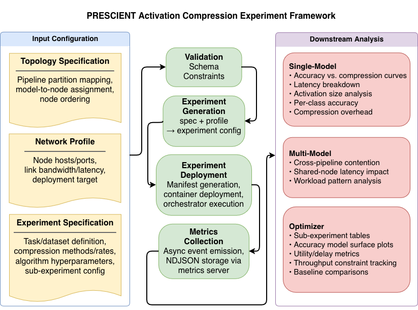
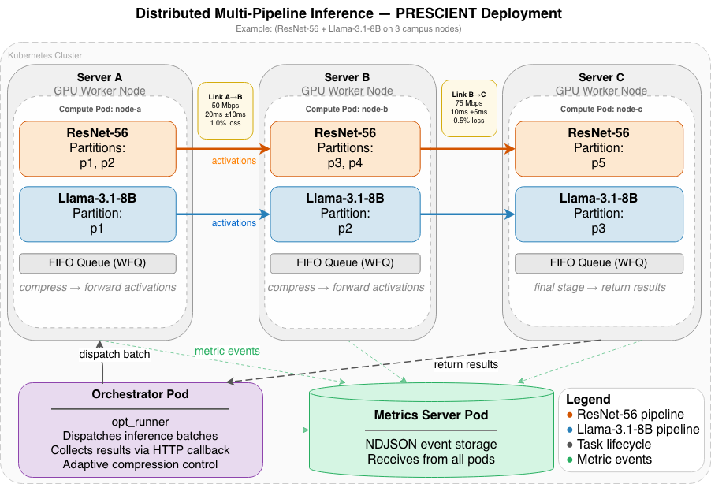

# DNN-comm-compression

This is an evaluation framework developed on the OSU PRESCIENT testbed, accompanying the work:

**Communication-Aware Model Distributed Inference via Latent Representation Compression
(MobiHoc 2026)**

The compression optimizer code (dependency) is available [here](https://github.com/neu-spiral/communication-aware-inference).
 
A research framework for distributed DNN inference with communication compression. Models are partitioned into sequential pipeline stages deployed across multiple nodes (containers). Intermediate activations transmitted between nodes are optionally compressed to reduce communication overhead. The framework supports sweeping over compression methods and rates, collecting metrics, and comparing results against baselines.



## Documentation

- [Configuration](docs/config.md) — experiment and infrastructure config schemas
- [Compression](docs/compression.md) — compression interface and implementations
- [Node Server](docs/node.md) — inference API, management API, link probing
- [Metrics](docs/metrics.md) — metric events, async emission, metrics server
- [Orchestrator](docs/orchestrator.md) — experiment runner, sweep loop, data client
- [Multi-Model Experiments](docs/multi_task.md) — multi-pipeline node server, orchestrator, workload patterns
- [Optimizer Experiments](docs/optimizer.md) — adaptive compression optimizer, optspecs format, all sub-experiment types
- [Deployment](docs/deployment.md) — Docker images, Docker Compose and Kubernetes deployment
- [Analysis](docs/analysis.md) — post-processing, plots, and cleanup

### Model Guides

- [ResNet-56](docs/resnet.md) — partitioning, experiment configs, running on Docker and Kubernetes
- [Llama-3.1-8B](docs/llama.md) — partitioning, experiment configs, running Llama experiments

## Repository Layout

| Directory / File | Role |
|-----------------|------|
| `specs/` | Single-model experiment specs — model, partitioning, compression variants (what runs) |
| `multispecs/` | Multi-model experiment specs — multiple pipelines sharing nodes |
| `optspecs/` | Optimizer experiment specs — adaptive compression sub-experiments |
| `profiles/` | Infrastructure definitions — node addresses, resource limits, link shaping (where it runs) |
| `experiments/` | Generated output — gitignored; produced by `tools/generate.py` |
| `tools/generate.py` | Composes a spec + profile into a runnable experiment directory |
| `framework/` | All framework Python code (nodes, orchestrators, deploy, analysis, optimizer) |
| `models/` | Offline partitioning scripts and partition artifacts |
| `docker/` | Dockerfiles for each container role |
| `docs/` | Component reference documentation |

## Generated Artifacts

All paths are relative to the repo root. All are gitignored unless noted.

| Path | Written by | Contents |
|------|-----------|----------|
| `experiments/{name}/` | `tools/generate.py` | `experiment.yaml` (merged spec) and `infra.yaml` (profile copy) |
| `experiments/multi/{name}/` | `tools/generate.py --multi` | Same structure for multi-model experiments |
| `experiments/opt/{name}/` | `tools/generate.py --opt` | Same structure for optimizer experiments |
| `experiments/{name}/deploy/` | `framework.deploy` | `docker-compose.yml` or `manifests.yaml` |
| `experiments/{name}/plots/` | `framework.analysis.visualize` | PNG plots (accuracy, latency, pareto, etc.) |
| `metrics_data/{name}/*.ndjson` | Metrics server (during run) | One NDJSON file per event type: `result.ndjson`, `forward_pass.ndjson`, `compress.ndjson`, `decompress.ndjson`, `send.ndjson`, `link_probe.ndjson`, `opt_slot.ndjson`, `queue_snapshot.ndjson`, etc. |
| `artifacts/{name}/profiling/` | `opt_runner` | Per-method profiling results: `profiling_{method}.json` |
| `artifacts/shared/accuracy_models/` | `opt_runner` | Trained surrogate accuracy model files (`.json` + `.pkl`), keyed by model/topology/method/dataset |
| `results/{name}/tables/` | `framework.analysis.analyze` | `sub_exp_table.csv`, `modified_sub_exp_table.csv` |
| `figs/` | `framework.analysis.topology` | Topology diagram PNGs |
| `models/{model}/.partitions/` | `models/{model}/partition_*.py` | Model partition `.pt` files — produced once offline, consumed by compute nodes |

> **Note:** `metrics_data/` files are appended to on each run. Run `python -m framework.analysis.cleanup --experiment <name>` before re-running an experiment to avoid blending results from multiple runs.

## Setup

Install dependencies:

```bash
pip install -e ".[dev]"
```

Or use the Makefile:

```bash
make install-dev
```

## Code Formatting

```bash
make lint        # check for linting issues
make format      # format code
make lint-fix    # fix linting issues and format
```

## Generating an Experiment Config

Experiments are defined by composing a **spec** (what runs — model, partitioning, compression variants) with a **profile** (where it runs — topology, network conditions, resource limits). The `tools/generate.py` tool resolves the combination and writes a ready-to-deploy experiment directory under `experiments/`.

```bash
python tools/generate.py \
    --spec specs/resnet56/equal-split \
    --profile profiles/linear-3/100mbps.yaml
```

This produces `experiments/resnet56_equal-split_linear-3_100mbps/` containing:
- `experiment.yaml` — merged spec with all sub-experiments resolved
- `infra.yaml` — the profile verbatim

To include only specific sub-experiments:

```bash
python tools/generate.py \
    --spec specs/resnet56/equal-split \
    --profile profiles/linear-3/100mbps.yaml \
    --sub-experiments baseline topk_paired
```

Referenced baseline experiments are materialised automatically. See [docs/config.md](docs/config.md) for full documentation on specs, profiles, sub-experiments, and baseline references.

## Building Docker Images

```bash
make build                        # all images (tag: latest)
make build-resnet                 # ResNet compute node only
make build-llama                  # Llama compute node only
make build-multi                  # multi-pipeline compute node only
make build-metrics                # metrics server only
make build-orchestrator           # orchestrator only (CUDA image)

make build IMAGE_TAG=v0.2         # all images with a specific tag
```

See [docs/deployment.md](docs/deployment.md) for details on each image.

## Validating a Config

```bash
python -m framework.validate experiments/resnet56_equal-split_linear-3_100mbps
python -m framework.validate experiments/resnet56_equal-split_linear-3_100mbps --show-runs

# via Makefile
make validate EXPERIMENT=experiments/resnet56_equal-split_linear-3_100mbps
make validate EXPERIMENT=experiments/resnet56_equal-split_linear-3_100mbps SHOW_RUNS=1
```

Validation checks both configs, resolves infra inheritance, expands the sweep, validates node topology, and runs fairness checks against referenced baselines.

## Deploying an Experiment

```bash
python -m framework.deploy \
  --experiment experiments/resnet56_equal-split_linear-3_100mbps \
  --target docker \
  --image dnn-compute-resnet:latest \
  --partitions-dir models/resnet/.partitions \
  --dataset-dir .datasets/cifar10 \
  --apply
```

The orchestrator runs as a container inside the compose/k8s cluster and exits when the sweep completes. See [docs/deployment.md](docs/deployment.md) for multi-model and optimizer deploy examples, and the model-specific guides for full step-by-step instructions:
- [ResNet-56 on Docker / Kubernetes](docs/resnet.md)
- [Llama-3.1-8B](docs/llama.md)

## Multi-Model Experiments

Multi-model experiments co-locate multiple pipelines on shared nodes with a FIFO inference queue. Each node runs the multi-pipeline server; compression is configured independently per (pipeline, link) pair.

Multi-model specs live in `multispecs/` and are generated with the `--multi` flag:

```bash
python tools/generate.py --multi \
    --spec multispecs/resnet56_llama_mmlu \
    --profile profiles/linear-3-multi/100mbps.yaml
```

This produces `experiments/multi/resnet56_llama_mmlu_linear-3-multi_100mbps/`. Deploy and run:

```bash
python -m framework.deploy --multi \
  --experiment experiments/multi/resnet56_llama_mmlu_linear-3-multi_100mbps \
  --target docker \
  --image dnn-compute-multi:latest \
  --partitions-dir models \
  --dataset-dir .datasets \
  --apply
```

See [docs/multi_task.md](docs/multi_task.md) for the complete reference.

## Optimizer Experiments

Optimizer experiments use adaptive compression — the orchestrator runs a slot-based control loop that queries the external `Inference_Optimizer` library to choose per-pipeline compression rates dynamically, rather than sweeping a fixed grid.

Optimizer specs live in `optspecs/` and are generated with the `--opt` flag:

```bash
python tools/generate.py --opt \
    --spec optspecs/resnet56_llama_mmlu \
    --profile profiles/linear-3-multi/100mbps.yaml
```

This produces `experiments/opt/resnet56_llama_mmlu_linear-3-multi_100mbps/`. Deploy and run:

```bash
python -m framework.deploy --opt \
  --experiment experiments/opt/resnet56_llama_mmlu_linear-3-multi_100mbps \
  --target docker \
  --image dnn-compute-multi:latest \
  --partitions-dir models \
  --dataset-dir .datasets \
  --apply
```

Sub-experiment types include `no_csi` (Lyapunov-based, channel-free), `csi_aware` (closed-form η* with LCB), and a full set of single- and multi-task baselines. See [docs/optimizer.md](docs/optimizer.md) for the complete reference.

## Analyzing Results

```bash
python -m framework.analysis.analyze --experiment resnet56_equal-split_linear-3_100mbps
python -m framework.analysis.visualize --experiment resnet56_equal-split_linear-3_100mbps
```

## Model Partitioning

Partitioning scripts are in `models/` and are independent of the experiment framework. Run them once to produce partition artifacts consumed by node servers. More info in the model-specific instructions mentioned above.

## Deployment on PRESCIENT

Experiments are designed to run on the PRESCIENT network research testbed at the Ohio State University. PRESCIENT provides programmable wide-area network conditions (configurable bandwidth, delay, and loss across inter-node links), making it well-suited for evaluating the accuracy-vs-compression tradeoff under realistic communication constraints.



## Acknowledgments

This work was supported by the National Science Foundation
through the AI-EDGE Institute (Award No. 2112471) and by the
State of Ohio through the Central Ohio Broadband and 5G Super 
RAPIDS grant (OHSU02) for funding the PRESCIENT testbed. 

